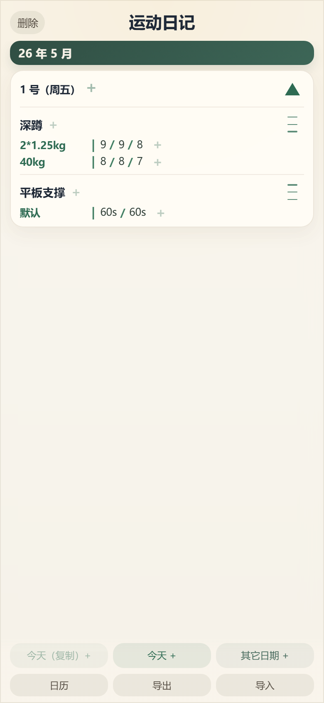

# 运动日记

一个适合手机使用的本地运动记录小应用。打开就是历史记录，可以按日期记录动作、负荷类型和每组数字，也可以安装到手机主屏幕当作独立应用使用。

## 功能演示

<p align="center">
  
</p>

- 点“今天 +”新建今天的训练。
- 在日期里添加动作，例如“深蹲”“卧推”“引体向上”。
- 在动作里添加类型，例如“默认”“40kg”“2*1.25kg”。
- 在类型后面记录每组数字，例如 `9 / 9 / 8`、`60s / 60s`。
- 点击已有数字可以编辑，点击数字之间或末尾的小加号可以插入新数字。
- 拖动动作右侧的三横线，可以调整同一天里动作的顺序。
- 点“今天（复制）+”可以把某天训练复制到今天。
- 点“日历”可以查看哪些日期有训练记录，并快速跳回那一天。
- 点“导出”可以保存 TXT 备份，点“导入”可以从 TXT 备份恢复记录。

## 安装和运行

先安装 Node.js，然后在项目目录运行：

```bash
npm install
npm run dev
```

浏览器里打开终端显示的地址即可使用。

## 手机安装

项目发布到网页后，可以像普通 PWA 一样安装到手机主屏幕。

Android Chrome：打开网页后，选择“安装应用”或“添加到主屏幕”。

iPhone Safari：打开网页后，点击分享按钮，选择“添加到主屏幕”。

当前线上地址：

```text
https://chantinping.github.io/movement-journal-app/
```

## 数据备份

记录只保存在当前浏览器或手机主屏幕应用的本地存储里，不会上传到服务器。换手机、清浏览器数据或重装前，建议先点“导出”保存备份。

备份文件是固定格式的 TXT。每一行是一条训练内容：

```text
日期 | 动作 | 类型 | 数字
2026-04-18 | 深蹲 | 2*1.25kg | 9 / 9 / 8
2026-04-18 | 卧推 | 40kg | 8 / 8 / 7
2026-04-19 | 平板支撑 | 默认 | 60s / 60s
```

如果要把其它 App 的历史记录导入，可以先让 LLM 整理成上面的 TXT 格式，再在本应用里点“导入”。导入会替换当前全部记录，所以导入前最好先导出一份当前备份。
